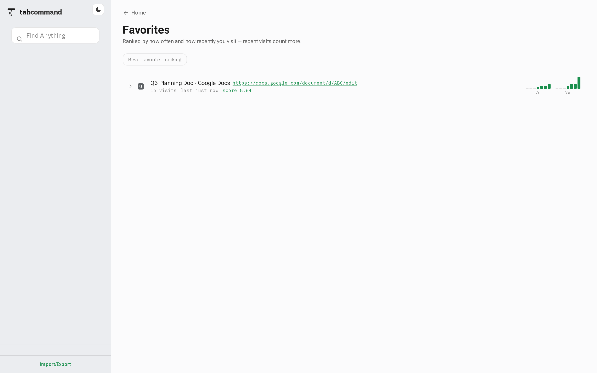
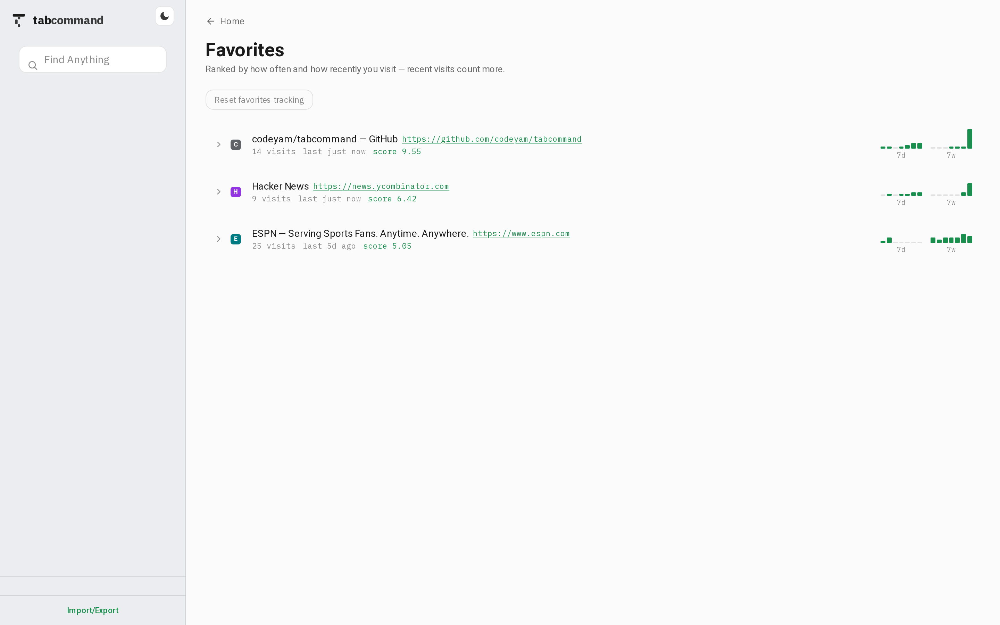
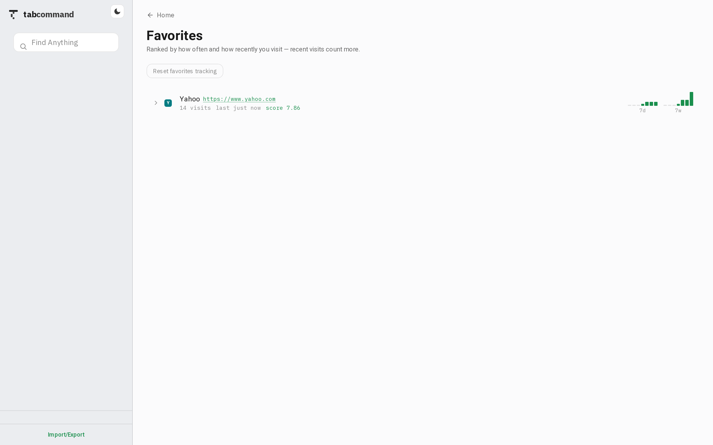
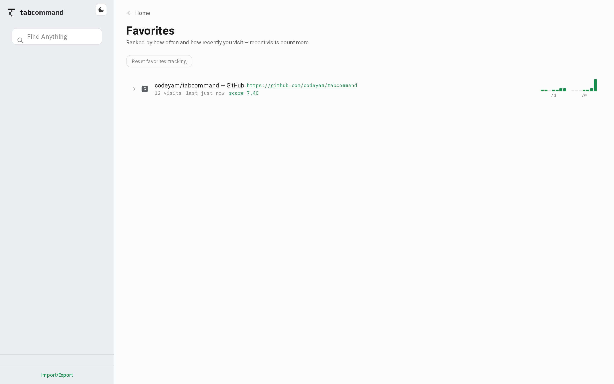
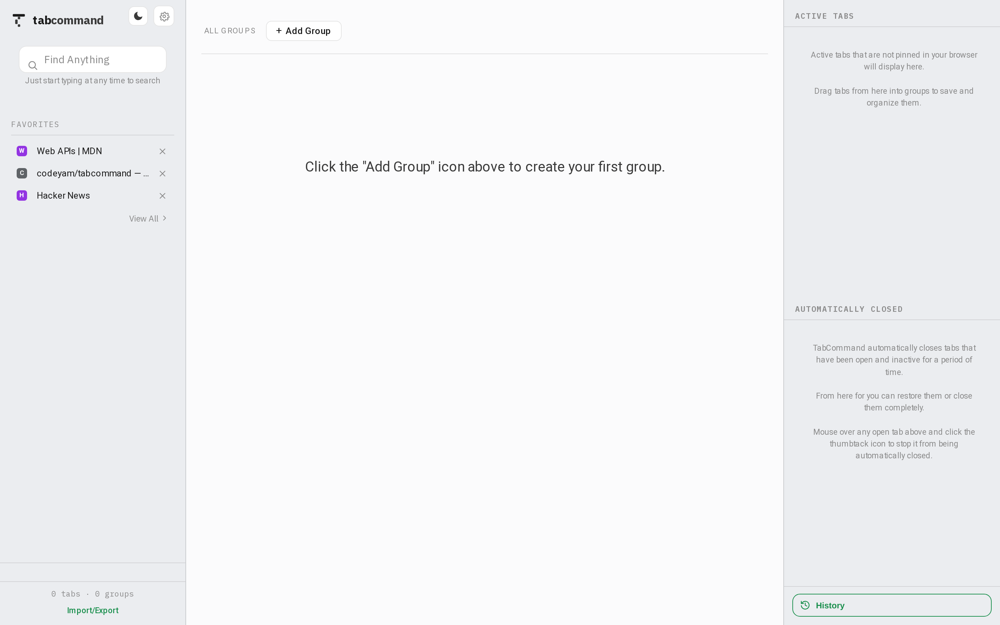
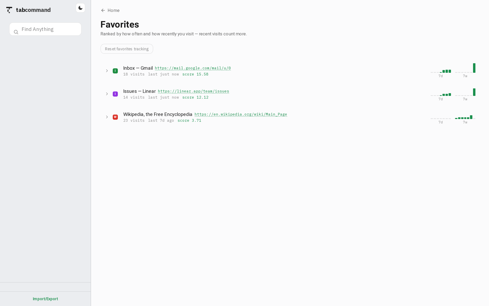
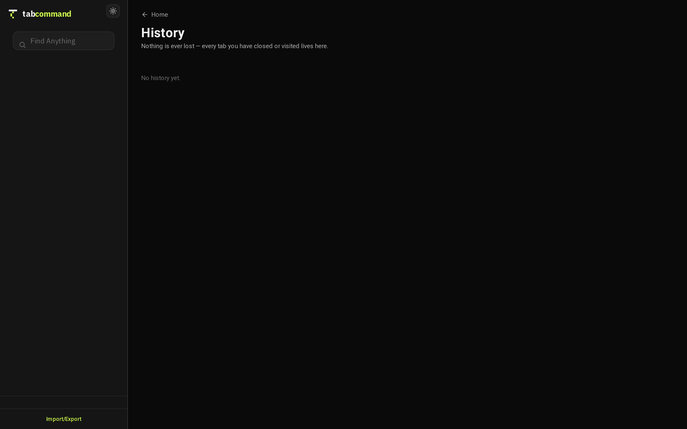

# TabCommand

[](https://github.com/codeyam-ai/tabcommand/actions/workflows/ci.yml)
[](./LICENSE)

**Complete Tab, Bookmark, and History Control**

TabCommand is a chrome extension designed to provide complete control over your tabs, bookmarks, and history. It features favorites, grouping, and auto-close settings.

<p align="center">
  
  
</p>


## Install TabCommand

TabCommand is available for free in the Chrome Extension store.

[TabCommand Chrome Extensions](https://chromewebstore.google.com/detail/tabcommand/admgekbonebggnabmhcihnmddeeipnlg)


<!-- codeyam:run-and-edit:start -->
## Develop this project with codeyam-editor

This project is built with [codeyam-editor](https://codeyam.com) — code and runnable data scenarios are authored side by side against a live preview.

```bash
# Clone the repo
git clone https://github.com/codeyam-ai/tabcommand && cd tabcommand

# Install codeyam-editor
npm install -g @codeyam-editor/codeyam-editor@latest

# Launch the editor (split-screen terminal + live preview)
codeyam-editor editor
```
<!-- codeyam:run-and-edit:end -->

**Install and Run TabCommand Locally**

```bash
# If the tabcommand repo is not already installed
git clone https://github.com/codeyam-ai/tabcommand && cd tabcommand

# Install dependencies
npm install

# Build tabcommand for installation as a chrome extension
npm run build
```

Then open `chrome://extensions` → enable **Developer mode** → **Load unpacked** →
select the `build/` folder. 


After making changes to the code you must re-run `npm run build` and reload the extension from the chrome extensions manager to pick up changes.


<!-- codeyam:scenario-gallery:start -->
## Scenario gallery

States captured as runnable scenarios with codeyam-editor:

### Favorites - Google Doc Survives Search Exclusion



### Favorites - Heavy Content Site Rolled Up



### Favorites - SERP Excluded Portal Kept



### Favorites - Search Engines Excluded



### Favorites - Sidebar With View All Link



### Favorites - Stats Survive URL Eviction



### History - Empty



### History - Populated


<!-- codeyam:scenario-gallery:end -->

## License

[MIT](./LICENSE) © 2026 NodLabs Inc.
