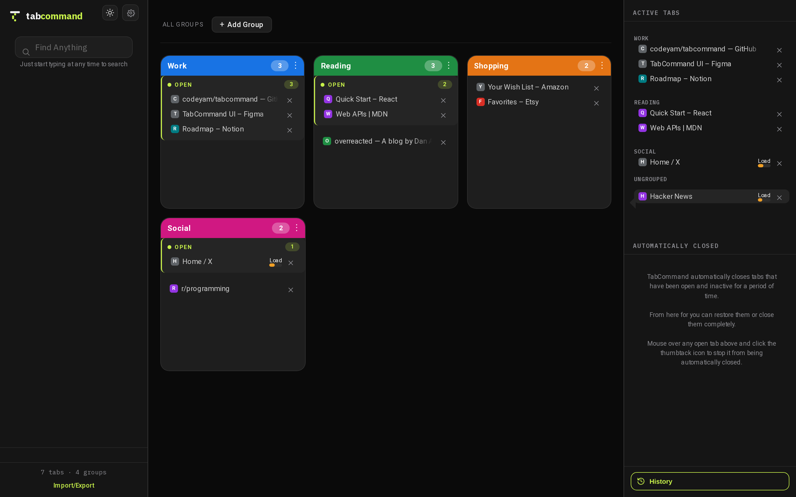
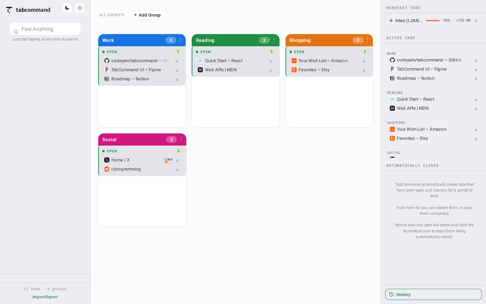
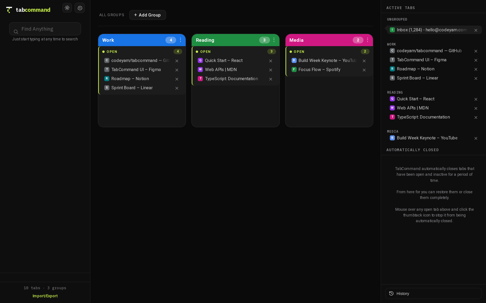
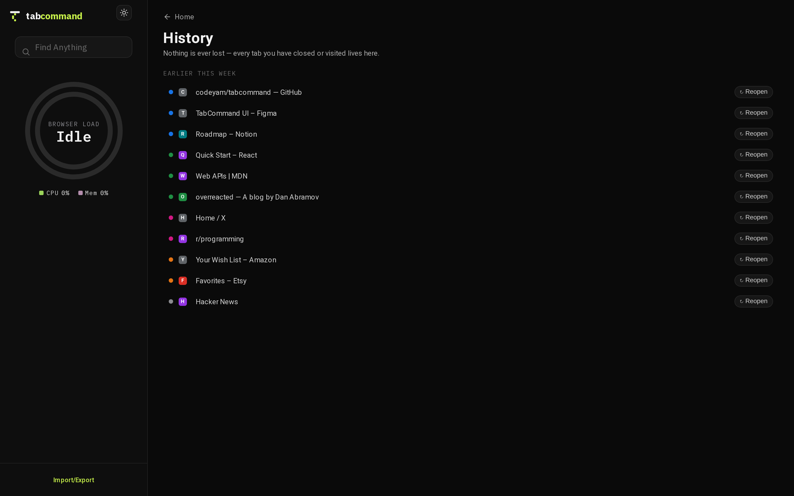
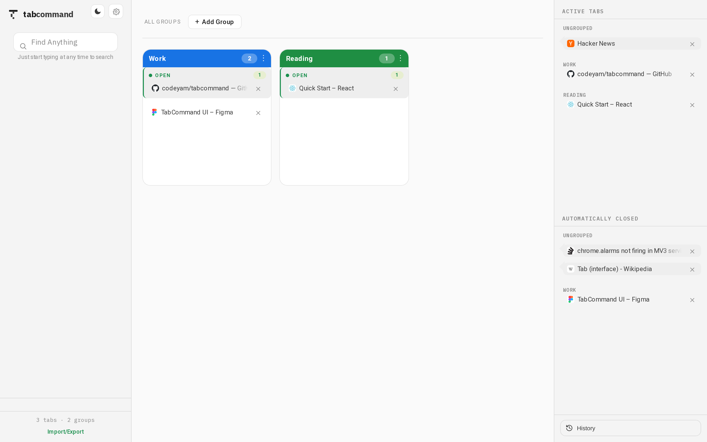
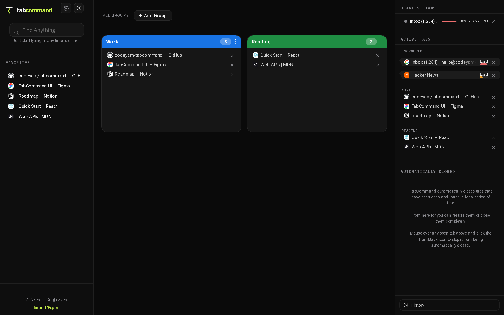
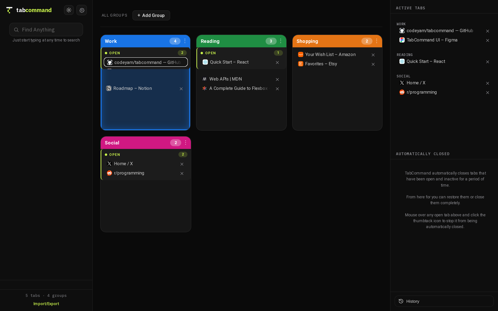
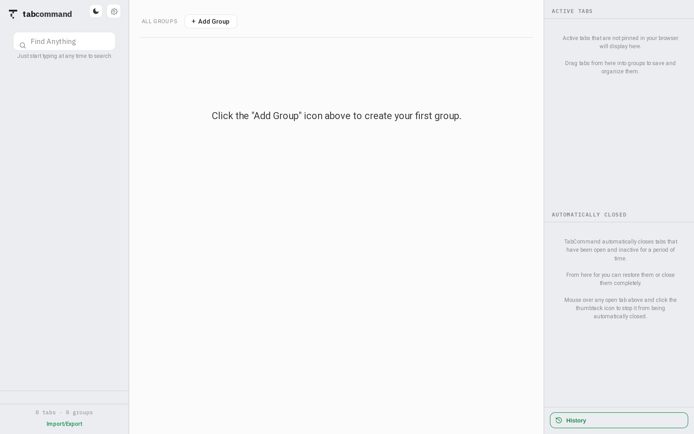
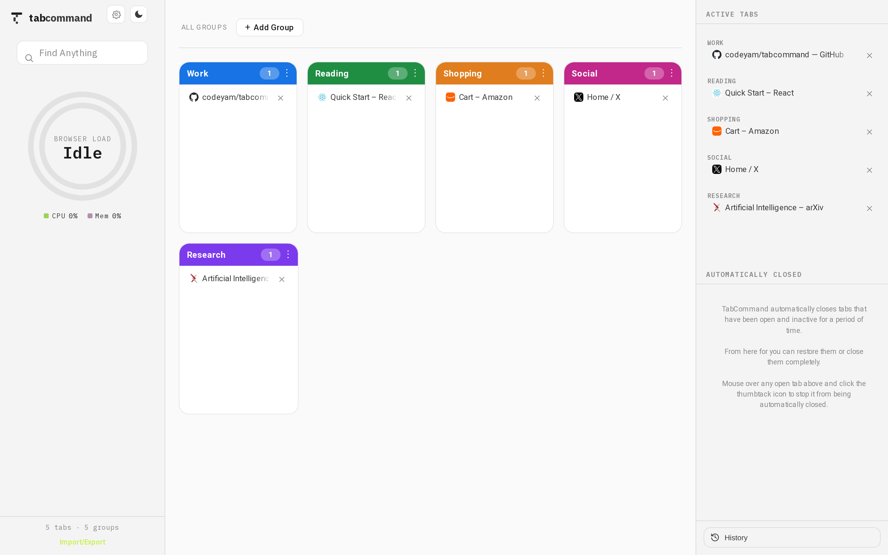
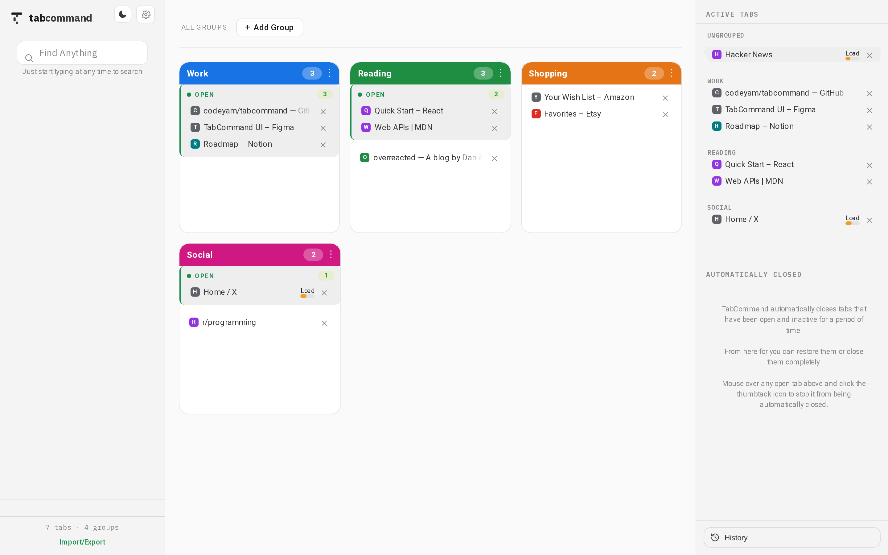

# TabCommand

[](https://github.com/codeyam-ai/tabcommand/actions/workflows/ci.yml)
[](./LICENSE)

**Command Central for your browsing experience** — a Manifest V3 Chrome extension that
monitors, searches, labels (groups), and auto-closes your browser tabs. The rich UI is a
full-page React app; the toolbar popup is just a launcher that opens it in a pinned tab.
All state lives in `chrome.storage.local` — there's no backend.

This repo is unusual in one deliberate way: **every UI state is captured as a
[codeyam](https://codeyam.com) scenario with a screenshot, and the whole app is
explorable — live — without installing anything.** You can see how TabCommand behaves in
40+ seeded states, then make changes through a workflow that keeps tests, a code glossary,
and those scenarios in sync.

<p align="center">
  
</p>

<p align="center">
  
  &nbsp;
  
</p>

## Develop with codeyam-editor

The primary way to work on TabCommand is [codeyam-editor](https://codeyam.com). It renders
every UI state as a live, interactive scenario against a mocked Chrome environment — so you
see the whole app, in every state (empty, populated, mid-search, load gauges high or low),
without ever loading it into Chrome — and drives changes through a plan workflow that keeps
tests, the code glossary, and scenarios in sync.

Prerequisites: **Node 22+** and npm.

```bash
npm install -g @codeyam-editor/codeyam-editor@latest
git clone https://github.com/codeyam-ai/tabcommand && cd tabcommand
npm install
codeyam-editor start      # opens the editor UI: scenario list + live preview
```

What the editor works with under the hood:

- **Scenarios** — every state is a file in `.codeyam/scenarios/*.json` (40+ of them), each
  with a captured screenshot under `.codeyam/scenarios/screenshots/`. A scenario seeds
  `localStorage`, so the exact state is reproducible and version-controlled — you can browse
  them straight in the repo without running anything.
- **Glossary** — `.codeyam/glossary.json` maps every component, page, and utility to its
  source file, its test file, and the scenarios it appears in.
- **Scenario taxonomy** — `.codeyam/state/scenario-taxonomy.json` tracks which UX states
  (empty / typical / many / loading / error) each view covers, and records *why* a state is
  N/A when it is.
- **The loop** — write a plan in `.codeyam/plans/`, let the editor drive the build; tests run
  on every change, scenarios re-capture, and an audit step flags any component that loses
  test or scenario coverage.

## Install locally

To run TabCommand as a real Chrome extension:

```bash
git clone https://github.com/codeyam-ai/tabcommand && cd tabcommand
npm install
npm run build    # outputs an unpacked MV3 extension to build/
```

Then open `chrome://extensions` → enable **Developer mode** → **Load unpacked** →
select the `build/` folder. Unpacked extensions don't auto-update — re-run `npm run build`
and reload the extension to pick up changes.

## How the mock environment works

TabCommand has no database — all state is `chrome.storage.local`. In codeyam previews and in
the test suite there is no extension `chrome` object, so an in-app **chrome shim**
(`src/lib/utils/chromeShim/`) installs onto `globalThis.chrome` **only when the real API is
absent**, implementing `storage.local`, `storage.onChanged`, and no-op
`tabs`/`tabGroups`/`processes` stubs. On boot it hydrates an in-memory store from every
`window.localStorage` key. That single mechanism is what lets the same React code run as a
real extension and in deterministic scenario captures and tests — a scenario just seeds
`localStorage`, and the UI renders exactly that state.

## Permissions

TabCommand requests only what it needs to monitor and organize your tabs, and everything
stays on your machine:

| Permission | Why it's needed |
|------------|-----------------|
| `tabs` | Read tab titles and URLs to list, search, and label your open tabs |
| `tabGroups` | Create and keep Chrome tab groups in sync with your labels |
| `storage` | Persist your tabs, labels, and settings in `chrome.storage.local` |
| `processes` | Show per-tab CPU, memory, and network load in the meter |
| `system.cpu`, `system.memory` | Show overall system load alongside the per-tab figures |

## Tech stack

Vite 5 · React 18 · `@crxjs/vite-plugin` (MV3) · `@hello-pangea/dnd` (drag & drop) ·
`minisearch` (search) · `gradient-path` (the load gauge) · Vitest + React Testing Library ·
ESLint 9 flat config.

## Contributing

Run the same checks CI runs before opening a pull request:

```bash
npm test         # Vitest + React Testing Library
npm run lint     # ESLint 9 (flat config)
```

See [CONTRIBUTING.md](./CONTRIBUTING.md) for the full workflow.

## License

[MIT](./LICENSE) © 2026 NodLabs Inc.

<!-- codeyam:run-and-edit:start -->
## Develop this project with codeyam-editor

This project is built with [codeyam-editor](https://codeyam.com) — code and runnable data scenarios are authored side by side against a live preview.

```bash
# Launch the editor (split-screen terminal + live preview)
codeyam-editor editor

# Run the app
npm run dev

# Run the tests
npx vitest run
```
<!-- codeyam:run-and-edit:end -->

<!-- codeyam:scenario-gallery:start -->
## Scenario gallery

States captured as runnable scenarios with codeyam-editor:

### History - Populated



### Home - Automatically Closed



### Home - Dark Mode



### Home - Dragging Tab onto Group



### Home - Empty



### Home - Four Columns



### Home - Grouped


### Home - Light Theme


<!-- codeyam:scenario-gallery:end -->
