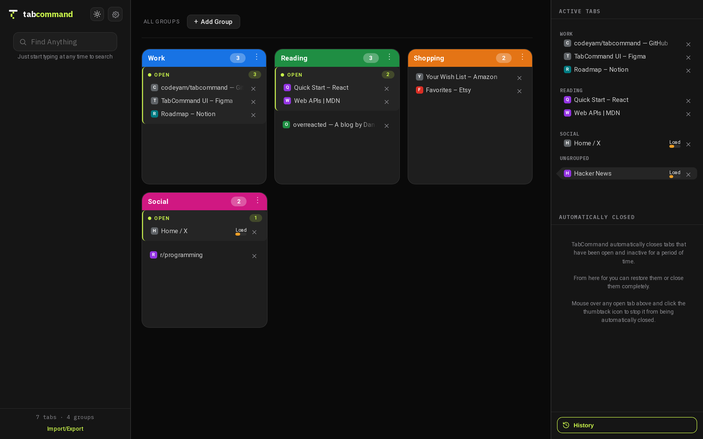
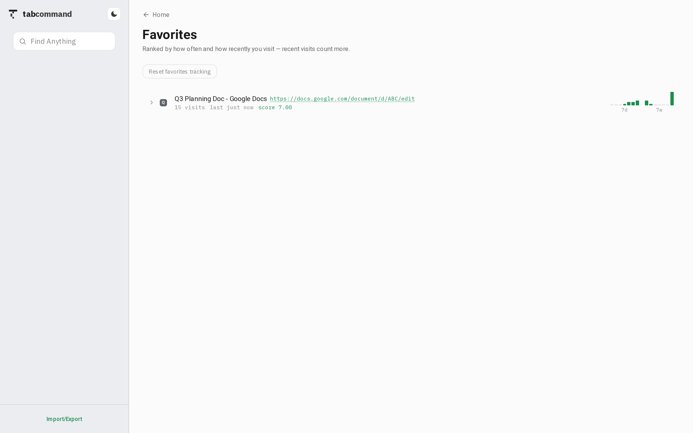
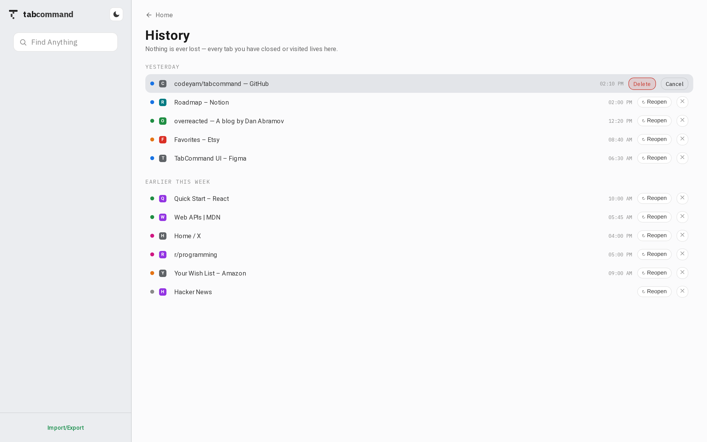
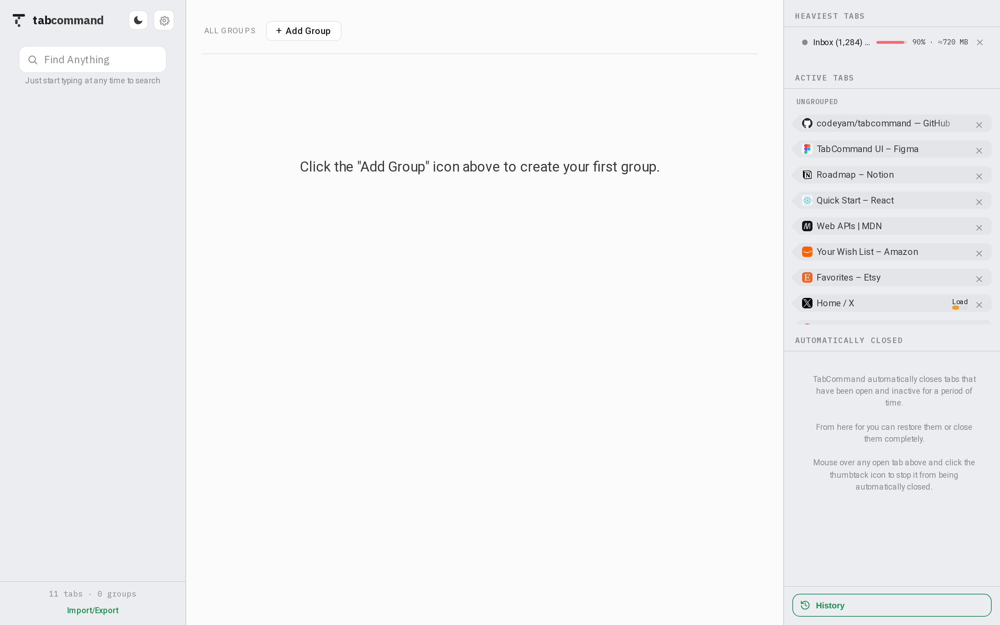
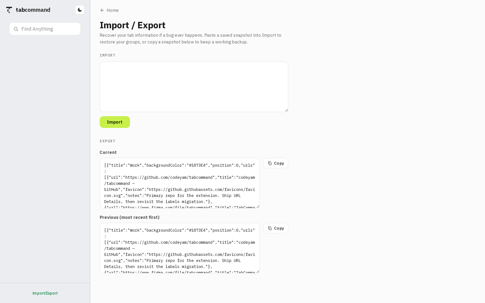
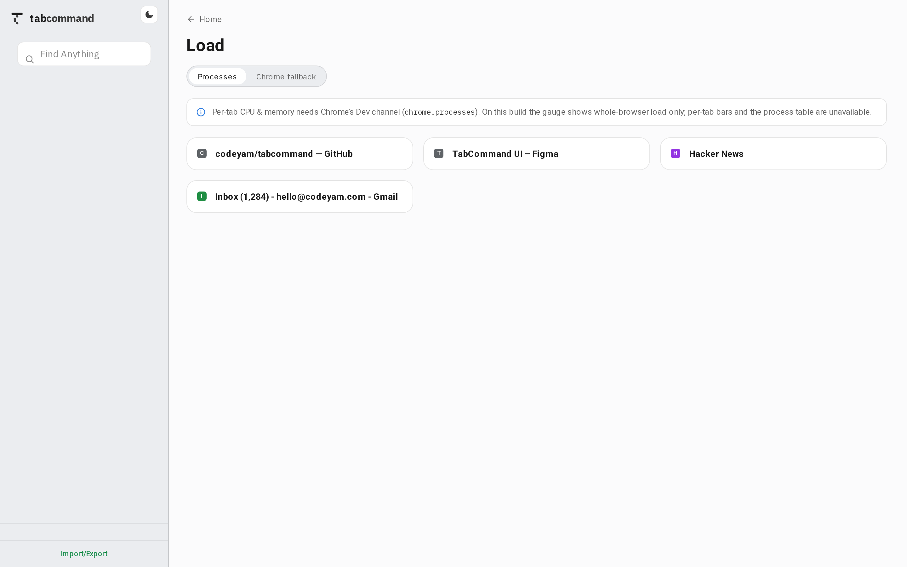
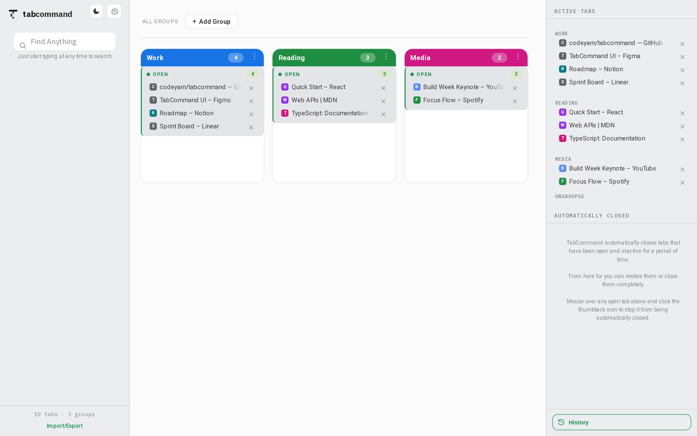
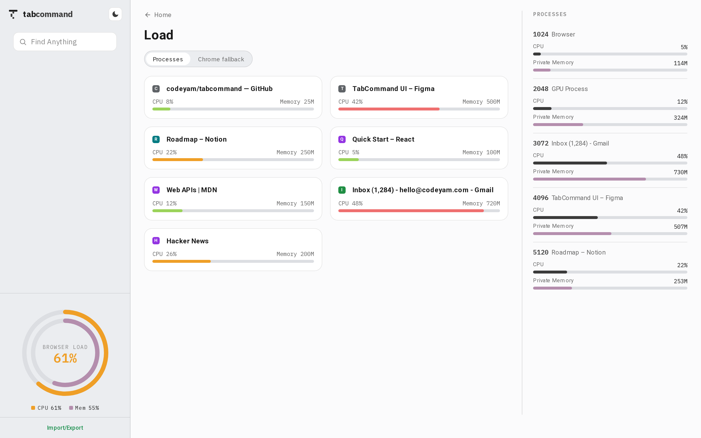

# TabCommand

[](https://github.com/codeyam-ai/tabcommand/actions/workflows/ci.yml)
[](./LICENSE)

**Complete Tab, Bookmark, and History Control**

TabCommand is a chrome extension designed to provide complete control over your tabs, bookmarks, and history. It features favorites, grouping, and auto-close settings.

<p align="center">
  
  
</p>


## Install TabCommand

TabCommand is available for free in the Chrome Extension store.

[TabCommand Chrome Extensions](https://chromewebstore.google.com/detail/tabcommand/admgekbonebggnabmhcihnmddeeipnlg)


<!-- codeyam:run-and-edit:start -->
## Develop this project with codeyam-editor

This project is built with [codeyam-editor](https://codeyam.com) — code and runnable data scenarios are authored side by side against a live preview.

```bash
# Clone the repo
git clone https://github.com/codeyam-ai/tabcommand && cd tabcommand

# Install codeyam-editor
npm install -g @codeyam-editor/codeyam-editor@latest

# Launch the editor (split-screen terminal + live preview)
codeyam-editor start
```
<!-- codeyam:run-and-edit:end -->

**Install and Run TabCommand Locally**

```bash
# If the tabcommand repo is not already installed
git clone https://github.com/codeyam-ai/tabcommand && cd tabcommand

# Install dependencies (pins the npm version, then installs)
npm run setup

# Build tabcommand for installation as a chrome extension
npm run build
```

Then open `chrome://extensions` → enable **Developer mode** → **Load unpacked** →
select the **`dist/extension/`** folder.

> Load `dist/extension/`, not `build/`. `build/` is a scratch directory that is
> deleted and recreated on every build — and if Chrome reads it while it is
> missing, it treats the extension as uninstalled and **destroys its stored
> data with it**. `dist/extension/` is created once and never removed wholesale,
> so it is always safe to have loaded.

After making changes to the code you must re-run `npm run build` and reload the extension from the chrome extensions manager to pick up changes.

### Upgrading from an earlier build

This version pins the extension's ID to TabCommand's published identity and
moves your groups into Chrome's synced storage, so they survive an uninstall and
follow your Google account. Two one-time consequences:

- **Export your groups before you load the rebuilt extension.** Pinning the ID
  changes the unpacked build's ID one final time, which gives it a fresh storage
  partition. Open TabCommand → **Import/Export**, copy the Current snapshot, load
  the new build, then paste it back into Import.
- **The unpacked build and a Web Store install can no longer both be loaded.**
  They now share one identity, and Chrome refuses the second. Remove one before
  adding the other.


<!-- codeyam:scenario-gallery:start -->
## Scenario gallery

States captured as runnable scenarios with codeyam-editor:

### Favorites - Google Doc Survives Search Exclusion



### History - Delete Confirm Armed



### Home - All Groups Deleted Tabs Survive



### Import / Export - Backup



### Labels - Populated


### Load - Stable Chrome Fallback



### Load Meter - High



### Load Page


<!-- codeyam:scenario-gallery:end -->

## License

[MIT](./LICENSE) © 2026 NodLabs Inc.
